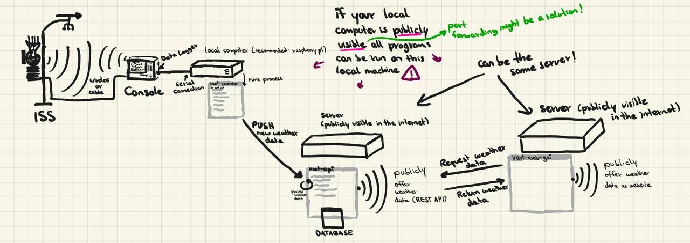

# vant-api

API for storing and retrieving vantage weather data.
Following image shows how all `vant-*` programs may work together.




### ⚠️ Development in early progress

Non functional yet!


### Sneak peaks

To start the vantage api, just run the following code:
```ts
import { startVantageAPI } from "vant-api";

startVantageAPI({
        units: {
            rain: "mm",
            ...
        },
        port: 8000,
    });
```
You can also use the `useEnvironmentVariables` option and
save your config in the `.env` file.

To start the recorder, run the following code:
```ts
import { Recorder } from "vant-api";

async main(){
    const recorder = await Recorder.create({
        path: "COM5",
        api: "http://localhost:8000/api",
        rainCollectorSize: "0.2mm",
        units: {
            rain: "mm",
            ...
        },
    });

    recorder.configureRealtimeRecordings({
            interval: 10,
        });

    recorder.start();
}

main();
```
You can also use the `useEnvironmentVariables` option and
save your config in the `.env` file.